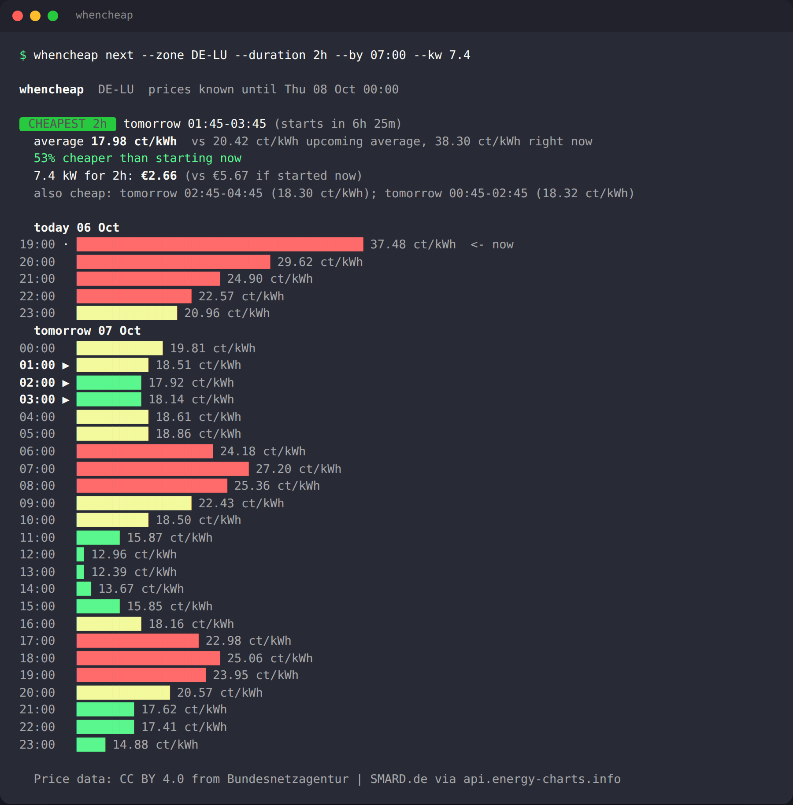

# whencheap

**Find the cheapest hours to run things — from public day-ahead electricity prices or your own time-of-use tariff.**

[](https://github.com/kosys0224-spec/whencheap/actions/workflows/ci.yml)
[](https://www.python.org/)
[](pyproject.toml)
[](LICENSE)

```bash
whencheap next --zone DE-LU --duration 2h --by 07:00 --kw 7.4   # "when should the EV charge tonight?"
whencheap run  --zone FR    --duration 3h -- ./backup.sh         # wait for the cheapest 3 hours, then run
```



Electricity on a dynamic tariff can cost three times as much at 19:00 as at 13:00 the next day. whencheap answers one question — **given a job that takes N hours, when is the cheapest time to start it before my deadline?** — and can wait and run the job for you. It is a single command with no dependencies, no account and no API key, and it also works offline with a plain JSON description of a fixed time-of-use plan.

## Why

Dynamic and time-of-use tariffs are spreading (Agile Octopus in GB, Tibber/aWATTar/Ostrom in DE/AT/NL, spot tariffs across the Nordics, TOU plans almost everywhere else), and day-ahead prices are published every afternoon by the exchanges and TSOs. Yet the tooling to *act* on them is mostly locked inside Home Assistant integrations or a vendor's app. If you just want a cron job, a shell script, an EV charger script or a build server to start at the cheapest moment, there was nothing to `pip install`.

## Features

- **Cheapest contiguous window** for any duration (`90m`, `2h`, `1h30m`), with deadlines (`--by 07:00`), earliest start (`--after 22:00`), horizon (`--within 12h`) and a price cap (`--max-price`).
- **Real cost** for your load (`--kw 7.4` → "€2.66 vs €5.67 if started now") and up to three alternative windows.
- **`run`** waits until the window starts and executes your command; **`wait`** just sleeps (for shell scripts); `--max-wait` and `--dry-run` for cron.
- **Price providers, all keyless:**

  | Provider | Zones | Unit | Resolution |
  |---|---|---|---|
  | [Energy-Charts](https://api.energy-charts.info/) (Fraunhofer ISE) | 45 European bidding zones: `DE-LU`, `FR`, `NL`, `AT`, `BE`, `CH`, `PL`, `SE4`, `NO2`, `IT-North`, … | ct/kWh | 15 min / 1 h |
  | [aWATTar](https://www.awattar.de/services/api) | `awattar:DE`, `awattar:AT` | ct/kWh | 1 h |
  | [Octopus Energy Agile](https://developer.octopus.energy/) | `GB-A` … `GB-P` (14 DNO regions) | p/kWh incl. VAT | 30 min |
  | [Energi Data Service](https://www.energidataservice.dk/) (Energinet) | `energidata:DK1`, `energidata:DK2` | øre/kWh | 1 h |
  | [Elering](https://dashboard.elering.ee/) | `elering:EE`, `elering:FI`, `elering:LV`, `elering:LT` | ct/kWh | 1 h |
  | Static time-of-use file | `tou:plan.json` — anywhere | your unit | from your plan |

- **Honest about data limits**: prints how far ahead prices are known, and says so when tomorrow's prices are not published yet (usually ~13:00 CET).
- **Caches** fetched prices on disk (30 min) so cron jobs never trip the providers' rate limits; prints each provider's required attribution.
- `--json` for every command; `--prices-file` to run entirely from a saved JSON (reproducible, testable, scriptable).
- Zero dependencies, Python 3.9+, Linux / macOS / Windows.

## Quick start

```bash
pipx install git+https://github.com/kosys0224-spec/whencheap   # or: pip install git+https://github.com/kosys0224-spec/whencheap
whencheap zones                                                  # what is available
whencheap prices --zone NL                                       # today's and tomorrow's prices as a bar chart
whencheap next --zone GB-C --duration 90m --by 06:30             # cheapest 90 min before 06:30, London region
```

No install:

```bash
git clone https://github.com/kosys0224-spec/whencheap && cd whencheap
python3 -m whencheap next --prices-file examples/sample-prices-DE-LU.json -d 2h --now 2026-10-06T17:20:00Z
```

(`examples/sample-prices-DE-LU.json` is a real two-day DE-LU day-ahead curve, so everything in this README can be reproduced offline.)

## Examples

**EV charging before the morning commute** — 7.4 kW charger, needs two hours, must be done by 07:00:

```bash
whencheap next -z DE-LU -d 2h --by 07:00 --kw 7.4
```

**Run a job at the cheapest time tonight, from a plain cron entry** — at 18:00 every day, find the cheapest 3-hour slot before 08:00 and run the backup then (gives up if the slot is more than 12 h away):

```cron
0 18 * * *  whencheap run -z FR -d 3h --by 08:00 --max-wait 12h -- /usr/local/bin/backup.sh
```

**Shell script with `wait`:**

```bash
whencheap wait -z awattar:AT -d 45m --within 10h && ./train-model.sh
```

**Only run if power is actually cheap** (exit 1 otherwise):

```bash
whencheap run -z GB-H -d 1h --max-price 8 -- ./heat-water.sh
```

**Your own tariff where there is no spot market** — Korea, most of the US, many flat/TOU contracts:

```bash
whencheap next -z tou:examples/tou-example.json -d 3h --tz Asia/Seoul
```

```json
{
  "name": "Example 3-tier time-of-use plan",
  "unit": "KRW/kWh",
  "timezone": "Asia/Seoul",
  "default": 120.0,
  "periods": [
    {"days": "mon-fri", "from": "10:00", "to": "12:00", "price": 196.0, "label": "peak"},
    {"days": "all",     "from": "22:00", "to": "08:00", "price": 86.0,  "label": "off-peak"}
  ]
}
```

Full format in [docs/tou-format.md](docs/tou-format.md).

**Machine-readable:**

```bash
whencheap next -z DE-LU -d 2h --json | jq .best
```
```json
{ "start": "2026-10-07T10:15:00+00:00", "end": "2026-10-07T12:15:00+00:00", "avg_price": 12.5052, "minutes": 120.0 }
```

### Commands and flags

| Command | What it does |
|---|---|
| `next -d DUR` | show the cheapest window (plus chart, cost, alternatives) |
| `run -d DUR -- CMD…` | wait for the window, then run CMD; exit code is CMD's |
| `wait -d DUR` | sleep until the window starts |
| `prices` | upcoming prices as a bar chart; `--tomorrow`, `--slots`, `--hours N` |
| `zones` | list providers and zones |
| `cache [--clear]` | inspect / clear the on-disk cache |

Common options: `-z/--zone` (or `WHENCHEAP_ZONE`), `--by HH:MM`, `--after HH:MM`, `--within DUR`, `--kw`, `--max-price`, `--max-wait`, `--top N`, `--tz Europe/Berlin`, `--json`, `--no-cache`, `--prices-file FILE`, `--no-color`.

Exit codes: `0` window found / command succeeded, `1` no window fits (or above `--max-price` / `--max-wait`), `2` error.

## How it works

1. The zone is resolved to a provider (`DE-LU` → Energy-Charts, `GB-C` → Octopus, `awattar:AT`, …). The provider fetches today + tomorrow with one HTTPS request (stdlib `urllib`) and normalises everything to a `PriceSeries` of `(start, end, price)` slots in a per-kWh unit. The result is cached for 30 minutes.
2. `find_windows()` slides a window of the requested duration over the future slots. Candidate starts are *now* and every slot boundary, so a 2-hour window can start at 17:20 (right now) or at 01:45. The average is time-weighted, which keeps 15-minute, 30-minute and hourly data honest, and a window is only valid if the series covers all of it. Alternatives are kept at least half a window apart so they are genuinely different times.
3. `run` sleeps in ≤60 s steps until the start, then `exec`s your command and returns its exit code.

Nothing is executed from the network; the only outbound traffic is the one price request per provider per half hour.

## Data notes and attribution

- Energy-Charts data for AT, BE, CH, CZ, DE-LU, DE-AT-LU, DK1, DK2, FR, HU, IT-North, NL, NO2, PL, SE4 and SI is **CC BY 4.0 from Bundesnetzagentur | SMARD.de**; the API marks its other zones *for private and internal use only*. whencheap prints the attribution line with every result. The API allows 2 requests/minute — the cache exists so you never notice.
- Prices are **wholesale day-ahead** prices (plus VAT in the case of Octopus Agile). Your bill adds grid fees, levies and your supplier's margin; those are usually constant per kWh, so the *cheapest hour* is the same, but the euro amounts shown are wholesale only unless you use a `tou:` file with your real tariff.
- Tomorrow's prices appear around 12:45–13:30 CET (EPEX/Nord Pool auction). Before that, "tomorrow" means the data is simply not there yet; whencheap tells you.
- On Windows, `--tz` and TOU time zones need `pip install tzdata`.

## Roadmap

- [ ] PyPI release (`pip install whencheap`)
- [ ] Non-contiguous windows (`--split`) for interruptible loads such as dishwashers and batteries
- [ ] Carbon-intensity mode (run when the grid is *greenest*) once a keyless source with forecasts is available
- [ ] More keyless sources: Nord Pool via other TSO dashboards, Australian AEMO, US ISOs with public day-ahead feeds (ComEd, PJM), Tibber/Ostrom with a user token
- [ ] `whencheap serve`: tiny HTTP endpoint for Home Assistant / Node-RED / shell integrations
- [ ] Homebrew tap, `pre-commit`-style GitHub Action for scheduled CI jobs

Want a provider added? Open an issue with the API URL and a sample response — a provider is one 30-line file (see [CONTRIBUTING.md](CONTRIBUTING.md)).

## Contributing

Bug reports, new providers and tariff examples are welcome. Tests run offline against recorded responses: `python -m unittest discover -s tests -v`.

## Related

- [Energy-Charts](https://energy-charts.info/) and [SMARD](https://www.smard.de/) — the public price data this uses
- Home Assistant [Nord Pool](https://www.home-assistant.io/integrations/nordpool/) / [Tibber](https://www.home-assistant.io/integrations/tibber/) integrations — the same idea, inside Home Assistant
- [Octopus Agile API docs](https://developer.octopus.energy/)

## License

[MIT](LICENSE) © 2026 Inhyeok Park. Price data remains under its providers' terms (see above).
